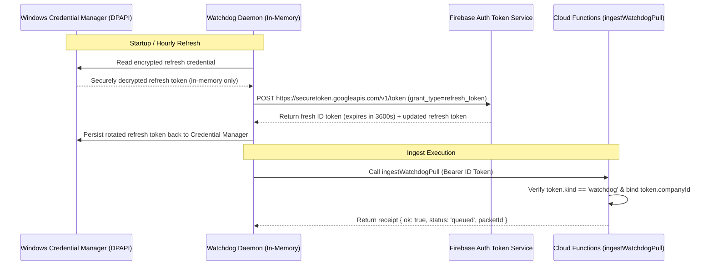

# Watchdog Secure Authentication & Authorization Contract

## 1. Overview & Threat Model

The WhatsApp Watchdog is an autonomous desktop sidecar daemon running on Windows. Its sole responsibility is ingesting verified operational well pulls observed from WhatsApp into the canonical WellBuilt Mobile (WB-M) pipeline.

### Hard Security Boundaries
- **No Service Account / Admin SDK Keys on Desktop**: Admin SDK keys grant unrestricted root access across Firestore, RTDB, and Auth. No service account key or Firebase Admin SDK is ever deployed to or stored on the desktop.
- **Dedicated Watchdog Principal**: The sidecar authenticates as a dedicated Firebase Auth user holding the custom claim `kind: 'watchdog'` and bound to its authorized company (`companyId: 'liquid-gold'`).
- **Zero Human Driver Claims**: The Watchdog user does NOT hold `kind: 'driver'` and cannot mint driver shifts, complete driver dispatches, or claim driver payroll.
- **Zero Commercial Authority**: Watchdog pulls never produce tickets, invoices, dispatches, billing entries, or payroll calculations.
- **Transport Observations Only**: Watchdog never computes or overrides AFR (Average Flow Rate) or tank geometry; observations are fed into the canonical `processIncomingPull` pipeline.

---

## 2. Token Lifecycle & Secure Storage Architecture

ID tokens in Firebase Auth are cryptographically signed JWTs with a strict 1-hour expiration time. Permanent raw ID tokens or API keys must never be written to disk.



### Windows Credential Manager / DPAPI Specification
- **Storage Target**: `WellBuilt/Watchdog/ingestWatchdogPull`
- **Mechanism**: Windows Data Protection API (`System.Security.Cryptography.ProtectedData` / `DataProtectionScope.CurrentUser`) or Windows Credential Manager (`Windows.Security.Credentials.PasswordVault` / `CredWriteW`).
- **Data Protection**:
  - Bound to the specific Windows user profile executing the daemon.
  - Decrypted strictly in memory on process launch and token refresh.
  - Never written to plain text files, logs, or state directories.
  - State files under `state/outbox` retain only operational identity hashes, never auth tokens.

---

## 3. Direct Database Access Containment Proof

The dedicated Watchdog principal is strictly prevented from directly accessing RTDB or Firestore. All operations MUST pass through the governed callables (`ingestWatchdogPull` and `getWatchdogPullReceipt`).

### RTDB Security Containment (`database.rules.secure.json`)
```json
{
  "rules": {
    ".read": false,
    ".write": false,
    "packets": {
      "incoming": {
        ".read": false,
        ".write": false
      },
      "processed": {
        ".read": "auth != null && (auth.token.kind == 'driver' || root.child('users').child(auth.uid).exists())",
        ".write": false
      },
      "rejected": {
        ".read": "auth != null && (root.child('users').child(auth.uid).child('role').val() == 'admin' || root.child('users').child(auth.uid).child('role').val() == 'it')",
        ".write": false
      }
    }
  }
}
```
- `packets/incoming`: `.write: false` and `.read: false`. Direct client writes and reads are denied outright.
- `packets/processed`: `.read` requires `auth.token.kind == 'driver'` or membership in `users/{uid}`. A principal with `kind: 'watchdog'` evaluates to **FALSE**, denying direct reads.
- Root `.read` and `.write`: Both default to **false**.

### Firestore Security Containment (`firestore.rules`)
- Commercial collections (`tickets`, `invoices`, `billing_invoices`, `dispatches`): Direct writes by non-human / automated principals are denied or constrained.
- Internal authority collections (`platform_admins`, `driver_shift_authority`, `platform_admin_audit`): Strictly `allow read, write: if false;`.
- Result: A client holding a Watchdog ID token receives `PERMISSION_DENIED` on any direct database attempt.

---

## 4. API Endpoints Contract

### Endpoint: `ingestWatchdogPull`
- **Type**: Firebase Functions v2 HTTPS Callable (`onCall`).
- **Authorization**: Requires Firebase Auth with custom claim `kind == 'watchdog'`.
- **Company Binding**: Authoritative from `request.auth.token.companyId`. If client sends `companyId` in payload, the call is rejected with `invalid-argument: company_override_forbidden`.
- **Payload Schema**:
  - `packetId` (string): Must match canonical mint format `YYYYMMDD_HHMMSS_{wellName}_{suffix6}`.
  - `wellName` (string): Valid existing well owned by caller's company.
  - `tankLevelFeet` (number): Tank top gauge level (0 - 60 ft).
  - `bblsTaken` (number): Explicit volume removed (0 - 100,000 bbls).
  - `dateTimeUTC` (string): ISO 8601 UTC timestamp. Cannot be in the future (> now + 5 min skew) or older than 30 days.
  - `timezone` (string): Defaults to `America/Chicago`.
  - `watchdogProvenance` (object, optional): Contains `chat`, `sender`, `eventTimeLocal`, `top`, `bottom`, `explicitBbl`, `parserVersion`, `digest`, `evidenceRef`.
- **Idempotency**: Checked against `packets/processed`, `packets/incoming`, and `packets/rejected`. Duplicate retry returns `duplicate: true` without re-writing.
- **Pipeline Target**: Writes strictly to `packets/incoming/{packetId}`. Triggers existing canonical `processIncomingPull`.

### Endpoint: `getWatchdogPullReceipt`
- **Type**: Firebase Functions v2 HTTPS Callable (`onCall`).
- **Authorization**: Same dedicated Watchdog principal (`kind == 'watchdog'`).
- **Tenant Scope**: Inspects caller's company ownership on the target packet. If the packet belongs to another company or does not exist, returns `{ found: false, status: 'not_found' }` to prevent cross-company packet scanning.
- **Responses**:
  - Queued: `{ ok: true, found: true, status: 'queued', packetId, wellName, submittedAt }`
  - Processed: `{ ok: true, found: true, status: 'processed', packetId, wellName, canonicalProcessingComplete: true, wellStatus: { currentLevel, currentLevelInches, lastPullPacketId } }`
  - Rejected: `{ ok: true, found: true, status: 'rejected', packetId, wellName, reason }`
  - Not Found: `{ ok: true, found: false, status: 'not_found', packetId }`
